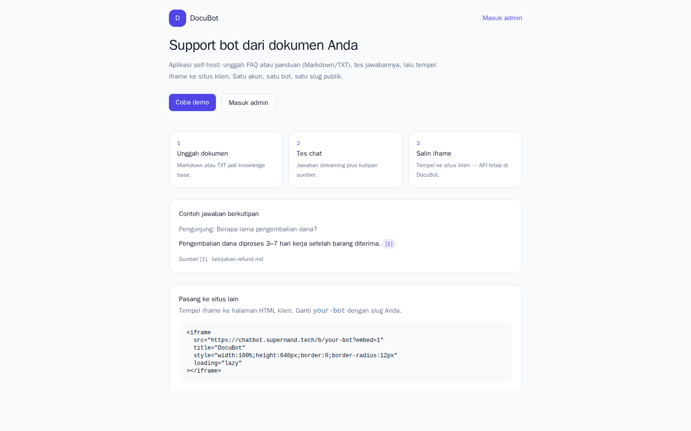
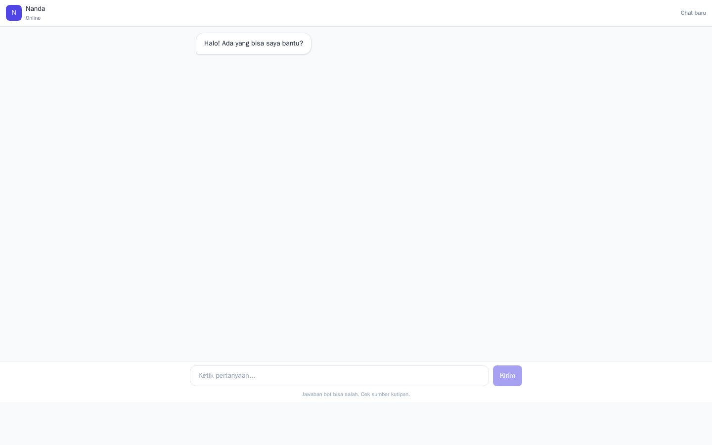

# DocuBot

Self-host AI support bot with a knowledge base (RAG). **Go (Gin) + React + SQLite + DeepSeek/OpenAI.**

License: [MIT](./LICENSE). Live demo: **https://chatbot.supernand.tech** (Docker Compose + host nginx). Try it: open the landing page, click **Coba demo**, and ask a question from the sample FAQ.

This is **not** a hosted SaaS, not multi-tenant, and not an npm chat widget.

## Screenshots





## Problem → what you get

Small teams answer the same FAQ all day; the answers already live in Markdown/TXT. DocuBot retrieves those chunks, streams a cited answer (SSE), and lets you **iframe** the same chat onto a client site.

You run it on your VPS. Visitors chat at `/b/{slug}`. Admins upload files, copy the iframe snippet, review conversations, and watch 14-day analytics.

Homepage (`/`) is a landing page, not the widget.

**Scale (honest):** retrieval is in-process cosine similarity over SQLite JSON embeddings. Fine for a typical FAQ corpus (comfortably under ~10k chunks). Not a pgvector cluster.

**Security model:** LLM keys stay on the server. Admin JWT is in `localStorage`. Public chat is unauthenticated and rate-limited. Iframes load DocuBot same-origin (no shop CORS). There is **no** per-bot `frame-ancestors` allowlist yet — see [SECURITY.md](./SECURITY.md).

## Quick start

```bash
cp .env.example .env
# Dummy keys are OK locally: StubEmbedder + StubLLM still reach status=ready and answer extractively.

docker compose up --build
# Frontend: http://127.0.0.1:3000
# Health:   http://127.0.0.1:3000/healthz
```

1. Open `/register` and create the **first** admin account (later sign-ups are closed unless you change `REGISTER_MODE`).
2. You land on **Pasang**. Upload a `.md`/`.txt` on **Dokumen** — or download the sample FAQ from the empty state.
3. Wait until status is `ready`, test in the Pasang playground (or open `/b/{slug}`), then copy the iframe snippet.
4. Paste the snippet into another HTML page (see `misc/example/embed-dummy.html`). Chat uses that bot's knowledge base.

Follow-up questions stay in the same tab (refresh keeps the session **per slug**; **Chat baru** starts over).

### Local development (without Docker)

**Backend**

Install Air once (`go install github.com/air-verse/air@latest`), then:

```bash
cd backend
# PowerShell
$env:DATABASE_PATH="..\data\docubot.db"
$env:UPLOAD_DIR="..\data\uploads"
air
```

Air watches `.go` files under `cmd/` and `internal/` and rebuilds the API automatically. Without live reload: `go run ./cmd/server`.

If `EMBED_API_KEY` / `LLM_API_KEY` are empty, the server uses deterministic stub embeddings and an extractive StubLLM (no external API).

**Frontend**

```bash
cd frontend
npm install
npm run dev
# Vite proxies /api and /healthz → localhost:8080
```

## Embed (iframe)

Copy from **Admin → Pasang**, or:

```html
<iframe
  src="https://YOUR-HOST/b/YOUR-SLUG?embed=1"
  title="DocuBot"
  style="width:100%;height:640px;border:0;border-radius:12px"
  loading="lazy"
></iframe>
```

The iframe loads DocuBot's own page; JavaScript inside it calls `/api/v1/...` **same-origin**. You do not need CORS on the client shop.

**Host nginx:** do **not** set `X-Frame-Options: DENY` or `SAMEORIGIN`, and do not set `Content-Security-Policy: frame-ancestors 'none'`, or sites cannot embed `/b/{slug}`. `frontend/nginx.conf` in this repo does not set those headers.

Dummy page for local tes: `misc/example/embed-dummy.html` (replace `SLUG`, open via a static server or the file path).

## Tests and CI

```bash
cd backend && go test ./...
```

GitHub Actions runs backend tests and the frontend production build on push/PR (`.github/workflows/ci.yml`).

On some Windows setups, WDAC blocks `handler.test.exe` in the Go cache. Compile with another name:

```bash
cd backend
go test -o tmp/htest.exe ./internal/handler
```

## Auth API

Register is **first-user-only** by default (`REGISTER_MODE=first-only`). After the first admin exists, `POST /auth/register` returns 403 unless you set `REGISTER_MODE=open` or pass `REGISTER_INVITE`. Check `GET /api/v1/auth/register-status`.

```bash
curl -s -X POST http://localhost:8080/api/v1/auth/register \
  -H "Content-Type: application/json" \
  -d '{"name":"Nanda","email":"nanda@example.com","password":"secret123"}'

curl -s -X POST http://localhost:8080/api/v1/auth/login \
  -H "Content-Type: application/json" \
  -d '{"email":"nanda@example.com","password":"secret123"}'
```

Login/register are rate-limited (5 requests/minute/IP). Chat is 10/minute/IP.

## Documents API

All routes need `Authorization: Bearer <token>`.

```bash
curl -s -X POST http://localhost:8080/api/v1/documents \
  -H "Authorization: Bearer <token>" \
  -F "file=@backend/testdata/manual-pengguna.md"
```

## Public bot & chat API (SSE)

```bash
# Profile
curl -s http://localhost:8080/api/v1/bots/nanda

# Landing demo pointer (oldest bot; configured=false if none)
curl -s http://localhost:8080/api/v1/demo

# Chat
curl -N -X POST http://localhost:8080/api/v1/b/nanda/chat \
  -H "Content-Type: application/json" \
  -d '{"message":"Gimana cara reset password?"}'
```

Events: `sources` → `token`* → `done` (or `inactive` / `error`). `conversation_id` in `done` is an opaque UUID (send it back on the next turn). Rate limit: 10 requests/minute/IP. LLM/SSE timeout is 60s.

Unknown slug: HTTP 404 JSON (chat does not fall back to another bot). The old paths `POST /api/v1/chat` and `GET /api/v1/bot` return 400 and point to the slug URLs.

## Admin API

- `GET/PUT /api/v1/admin/bot` (slug, name, welcome, active; frontend builds public URL from `window.location.origin`)
- `GET/PUT /api/v1/settings` (RAG knobs; identity fields dual-write to `bots`)
- `GET /api/v1/conversations?page=1&limit=20` (public channel only)
- `GET /api/v1/conversations/:id`
- `GET /api/v1/analytics/overview` (includes `total_tokens` and `estimated_usd`; public channel)
- `GET /api/v1/analytics/top-questions?limit=10`

## Benchmark

With the API running (after a document is `ready`). Set `SLUG` if you do not want the script to read `GET /api/v1/demo`:

```bash
# Git Bash / Linux / macOS
BASE_URL=http://127.0.0.1:8080 SLUG=nanda ./scripts/bench.sh

# PowerShell
.\scripts\bench.ps1 -BaseUrl http://127.0.0.1:8080 -Slug nanda
```

The script prints wall time, **time-to-first-token** (`ttft_ms`), server `latency_ms`, token usage, and an estimated USD cost using DeepSeek-chat list prices (override `OUT_PER_M` / `-OutPerMillion`). Record a real DeepSeek run in this README after deploy.

**Live run (2026-08-23, `https://chatbot.supernand.tech`, DeepSeek `deepseek-chat` + OpenRouter `nvidia/nemotron-3-embed-1b:free`, min_score 0.2):** median of 3 runs — **TTFT 882 ms**, server latency **1590 ms**, **~1294 tokens/chat**, **~$0.0014 USD/chat**. Target NFR-01 (TTFT < 2 s) is met. Locally with StubLLM, `total_wall_ms` is typically well under 1 s because StubLLM makes no network calls.

## Deploy (VPS)

1. Set `.env`: strong `JWT_SECRET`, `APP_ENV=production`, `LLM_API_KEY`, `EMBED_API_KEY`, `CORS_ORIGINS`. Production **refuses** to start with `JWT_SECRET=change-me-please`.
2. `docker compose up -d --build`
3. DNS A record `chatbot.supernand.tech` → VPS IP
4. Host nginx reverse-proxy to `127.0.0.1:3000` + Certbot SSL
5. Do **not** add `X-Frame-Options: DENY` / `SAMEORIGIN` on `/` or `/b/` if you need iframe embed

Example host nginx (SSE buffering off):

```nginx
server {
    server_name chatbot.supernand.tech;
    location / {
        proxy_pass http://127.0.0.1:3000;
        proxy_http_version 1.1;
        proxy_set_header Host $host;
        proxy_set_header X-Real-IP $remote_addr;
        proxy_set_header X-Forwarded-For $proxy_add_x_forwarded_for;
        proxy_set_header X-Forwarded-Proto $scheme;
        proxy_buffering off;
        proxy_read_timeout 75s;
    }
}
```

## Layout

- `backend/` — Go API (Gin + SQLite + RAG)
- `frontend/` — React (Vite + Tailwind)
- `data/` — SQLite DB + uploads (runtime, gitignored)
- `scripts/` — benchmark
- `misc/` — internal planning notes (see [`misc/README.md`](./misc/README.md)); not the public pitch

## Docs

- [CONTRIBUTING.md](./CONTRIBUTING.md) — run, test, PR scope
- [SECURITY.md](./SECURITY.md) — secrets, JWT, iframe
- [CHANGELOG.md](./CHANGELOG.md) — 0.2.0 = slug + landing + iframe
- [`misc/CONTEXT-OSS-PORTFOLIO.md`](./misc/CONTEXT-OSS-PORTFOLIO.md) — remaining packaging work (live demo, screenshots, DeepSeek bench)

## Stack

Go, Gin, SQLite, React, Vite, Tailwind, Recharts, DeepSeek (chat) / OpenAI-compatible embeddings, Docker.
