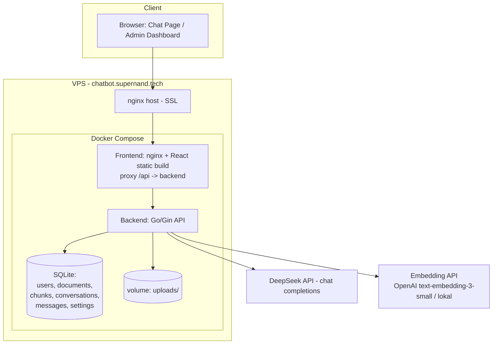
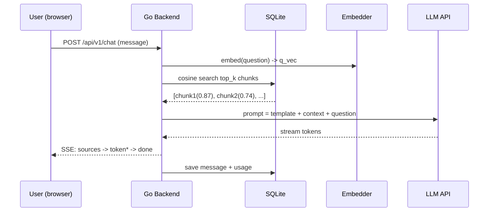

# BRD / PRD — DocuBot: AI Support Bot (Fullstack Go + React + RAG)

| Field | Value |
|---|---|
| **Nama Produk** | DocuBot (working title) — AI Support Bot dengan Knowledge Base |
| **Tipe Dokumen** | BRD + PRD (gabungan) |
| **Versi** | 1.2 |
| **Tanggal** | 21 Agustus 2026 |
| **Author** | Nanda (Software Engineer, Go + React) |
| **Tujuan Utama** | Portfolio item Upwork untuk mendapat client (Go API, React, Fullstack, AI/LLM) |
| **Tech Stack** | Go (Gin) + SQLite + React (Vite + Tailwind) + DeepSeek/OpenAI LLM + RAG |
| **Deploy** | VPS pribadi — Docker Compose + nginx, subdomain `chatbot.supernand.tech` |

> **Dokumen terkait:** status implementasi MVP → [`STATUS-GAPS-docubot-ai-support-bot.md`](./STATUS-GAPS-docubot-ai-support-bot.md). Plan setelah MVP (V2 self-host + embed) → [`PLAN-V2-docubot-selfhost-embed.md`](./PLAN-V2-docubot-selfhost-embed.md). Kemasan OSS + portofolio setelah V2 → [`CONTEXT-OSS-PORTFOLIO.md`](./CONTEXT-OSS-PORTFOLIO.md). Untuk pekerjaan V2, ikuti plan itu; dokumen ini tetap acuan RAG/API/skema MVP. Jangan pakai §11 sebagai status terkini.

---

## Daftar Isi

1. [Ringkasan Eksekutif](#1-ringkasan-eksekutif)
2. [Latar Belakang & Tujuan](#2-latar-belakang--tujuan-bisnis)
3. [Ruang Lingkup](#3-ruang-lingkup)
4. [Persona & User Stories](#4-persona--user-stories)
5. [Persyaratan Fungsional](#5-persyaratan-fungsional-fr)
6. [Persyaratan Non-Fungsional](#6-persyaratan-non-fungsional-nfr)
7. [Arsitektur Teknis](#7-arsitektur-teknis)
8. [Desain Database](#8-desain-database)
9. [API Specification](#9-api-specification)
10. [UI/UX & Wireframe](#10-uiux--wireframe)
11. [Rencana Implementasi](#11-rencana-implementasi-milestone)
12. [Strategi Testing](#12-strategi-testing--definition-of-done)
13. [Deployment & Environment](#13-deployment--environment)
14. [Risiko & Mitigasi](#14-risiko--mitigasi)
15. [KPI & Metrik Sukses](#15-kpi--metrik-sukses)
16. [Deskripsi Portfolio (siap tempel)](#16-deskripsi-portfolio-siap-tempel-bahasa-inggris)
17. [Roadmap Lanjutan](#17-roadmap-lanjutan)
18. [Referensi Riset](#18-referensi-riset)

---

## 1. Ringkasan Eksekutif

DocuBot adalah **aplikasi fullstack** berupa AI support bot yang menjawab pertanyaan customer **berdasarkan dokumen knowledge base** milik pemilik bisnis (PDF/Markdown/TXT), lengkap dengan **kutipan sumber** dan **admin dashboard**.

Produk ini dibangun dengan **satu tujuan utama: menjadi portfolio item nomor satu untuk mencari client di Upwork**. Karena itu, satu produk ini dirancang untuk membuktikan 5 kemampuan sekaligus:

| Kemampuan | Bukti dalam produk |
|---|---|
| Go API / Backend | REST API, JWT auth, upload file, streaming SSE, vector search |
| React Frontend | Chat widget + Admin Dashboard + grafik analytics |
| Fullstack | Satu produk end-to-end (backend + frontend + deploy) |
| AI/LLM Integration | RAG (Retrieval-Augmented Generation), embeddings, streaming |
| Engineering discipline | Unit test, struktur kode bersih, README, benchmark, Docker deploy |

**Target pasar Upwork:** client kecil-menengah yang butuh chatbot support / AI integration untuk bisnis mereka (e-commerce, SaaS kecil, agency, UMKM). Job types yang dibid: Go API, React web app, fullstack, AI/LLM integration, bugfix/optimization.

**Target pendapatan:** Rp 6 jt/bulan (±$370) dalam 2–3 bulan, via 1–2 proyek fixed-price $100–500.

---

## 2. Latar Belakang & Tujuan Bisnis

### 2.1 Masalah yang dipecahkan produk (untuk klien)

Bisnis kecil menengah menghadapi masalah berulang:
- Customer bertanya hal yang **sama berulang-ulang** (harga, cara pakai, kebijakan refund, dsb)
- Tim support kewalahan / mahal, tapi customer menuntut jawaban **cepat, 24/7**
- Informasi tersebar di dokumen (manual, FAQ, panduan) yang tidak pernah dibaca customer

DocuBot menjawab: **bot yang belajar dari dokumen yang sudah ada**, menjawab dengan kutipan sumber, sehingga customer percaya dan tim support fokus ke kasus sulit.

### 2.2 Tujuan produk sebagai portfolio (untuk Nanda)

1. **Menang di Upwork** — portfolio item yang membuktikan kemampuan end-to-end + AI
2. **Demo live** — klien bisa mencoba langsung di `chatbot.supernand.tech` (tidak perlu install)
3. **Kode bersih** — GitHub repo dengan README, unit test, struktur jelas (klien teknis baca ini)
4. **Angka** — benchmark response time, biaya operasional rendah (DeepSeek), bukti performa

### 2.3 Prinsip desain produk

- **Hasil, bukan fitur** — setiap fitur harus bisa diceritakan sebagai "problem → aksi → hasil"
- **Demo > deskripsi** — klien lebih percaya chat yang jalan daripada 1000 kata
- **Satu produk utuh** — bukan potongan-potongan terpisah
- **Biaya operasional mendekati nol** — LLM murah (DeepSeek), VPS sudah dimiliki

---

## 3. Ruang Lingkup

### 3.1 In-Scope (MVP)

| # | Fitur | Prioritas |
|---|---|---|
| 1 | Autentikasi admin (register, login, JWT) | P0 |
| 2 | Upload dokumen knowledge base (Markdown, TXT; PDF menyusul) | P0 |
| 3 | Parsing & chunking dokumen otomatis | P0 |
| 4 | Embeddings + vector search (cosine similarity) | P0 |
| 5 | Chat publik dengan streaming jawaban + kutipan sumber | P0 |
| 6 | Admin dashboard: kelola dokumen, log percakapan, on/off bot | P1 |
| 7 | Analytics: jumlah chat, top questions, grafik harian | P1 |
| 8 | Pengaturan bot (nama, welcome message, temperature, top-k) | P1 |
| 9 | Deploy Docker di VPS + domain + SSL | P0 |
| 10 | README, unit test, benchmark script | P0 |

### 3.2 Out-of-Scope (MVP) — sengaja ditunda

- ❌ Multi-tenant / multi-client (satu akun admin, satu bot)
- ❌ Embed widget `<script>` di website pihak ketiga (cukup halaman chat publik)
- ❌ Integrasi WhatsApp / Telegram / Slack
- ❌ Pembayaran / billing / subscription
- ❌ Multi-bahasa UI (UI cukup 1 bahasa; isi dokumen bisa bahasa apa pun)
- ❌ Voice / audio
- ❌ Model LLM lokal / self-hosted (Opsional, lihat Roadmap)

> **Aturan anti-scope-creep:** setiap ide baru ditulis ke §17 Roadmap, TIDAK masuk MVP.

### 3.3 Acceptance Criteria (produk jadi)

- [ ] User bisa register + login sebagai admin
- [ ] Admin upload file `.md`/`.txt` → status berubah `ready` dengan jumlah chunks
- [ ] Pengunjung chat → bot menjawab relevan dengan kutipan `[1] [2]` yang bisa diklik
- [ ] Jawaban di-streaming (token muncul bertahap, bukan menunggu selesai)
- [ ] Kalau jawaban tidak ada di dokumen → bot bilang "tidak tahu" (tidak mengarang)
- [ ] Admin bisa matikan bot (chat menampilkan pesan nonaktif)
- [ ] Admin melihat log percakapan + top 10 pertanyaan
- [ ] Seluruhnya berjalan di `chatbot.supernand.tech` via Docker Compose
- [ ] `go test ./...` hijau, README lengkap, ada script benchmark

---

## 4. Persona & User Stories

### 4.1 Persona

| Persona | Deskripsi | Kebutuhan |
|---|---|---|
| **Admin/Owner** (klien potensial) | Pemilik bisnis kecil / SaaS / agency, bukan programmer | Setup mudah, upload dokumen, bot aktif 24/7 |
| **Customer** (end user) | Pengunjung website yang punya pertanyaan | Jawaban cepat, akurat, ada sumbernya |
| **Nanda** (developer) | Pemilik produk, backend Go + frontend React | Kode bersih, testable, mudah demo & deploy |

### 4.2 User Stories

**Admin:**
- US-01: Sebagai admin, saya bisa register & login, agar data saya aman.
- US-02: Sebagai admin, saya bisa upload dokumen (`.md`, `.txt`), agar bot punya pengetahuan.
- US-03: Sebagai admin, saya bisa melihat status dokumen (processing/ready/failed), agar tahu apakah sudah bisa dipakai.
- US-04: Sebagai admin, saya bisa hapus & upload ulang dokumen, agar knowledge base selalu terbaru.
- US-05: Sebagai admin, saya bisa melihat log semua percakapan customer, agar tahu kualitas jawaban bot.
- US-06: Sebagai admin, saya bisa melihat top 10 pertanyaan, agar tahu topik yang paling dicari customer.
- US-07: Sebagai admin, saya bisa on/off bot dan ubah nama/welcome message, agar bisa kontrol kapan bot melayani.

**Customer:**
- US-08: Sebagai customer, saya bisa mengetik pertanyaan dan mendapat jawaban cepat.
- US-09: Sebagai customer, saya bisa melihat sumber jawaban (`[1]` = nama dokumen + cuplikan), agar saya percaya jawabannya.
- US-10: Sebagai customer, saya bisa melihat jawaban mengalir (streaming), agar tidak terasa lambat.
- US-11: Sebagai customer, jika bot tidak tahu jawabannya, bot mengatakannya dengan jujur, agar saya tidak tersesat.

---

## 5. Persyaratan Fungsional (FR)

> Format: `FR-xx` — prioritas P0/P1. Setiap FR punya kriteria terima singkat.

### 5.1 Autentikasi

- **FR-01** (P0) — Register admin: email unik + password (min 8 karakter), hash bcrypt.
- **FR-02** (P0) — Login → return JWT access token (expiry 24 jam) + profil user.
- **FR-03** (P0) — Middleware auth: semua route `/api/v1/admin/*` wajib header `Authorization: Bearer <token>`.
- **FR-04** (P1) — `GET /api/v1/auth/me` → profil user dari token.

### 5.2 Knowledge Base (Dokumen)

- **FR-05** (P0) — Upload dokumen via `multipart/form-data` (`.md`, `.txt`; ukuran max 5 MB).
- **FR-06** (P0) — Pipeline otomatis setelah upload: `extract → chunk → embed → ready`. Status transisi: `pending → processing → ready | failed`.
- **FR-07** (P0) — Chunking: potong teks per ~800 token dengan overlap 10% (batas paragraf lebih disukai).
- **FR-08** (P0) — Setiap chunk di-embed → vektor tersimpan di DB (BLOB JSON float array).
- **FR-09** (P0) — List dokumen dengan status, ukuran, jumlah chunk, timestamp.
- **FR-10** (P0) — Hapus dokumen (cascade hapus chunks-nya).
- **FR-11** (P1) — Re-process dokumen (upload ulang / embed ulang).
- **FR-12** (P1) — Support PDF (text-based) via `pdftotext` (poppler-utils) di container.

### 5.3 Chat (inti produk)

- **FR-13** (P0) — `POST /api/v1/chat` → SSE stream: `sources` → `token`×n → `done` | `error`.
- **FR-14** (P0) — Retrieval: query di-embed → cosine similarity ke semua chunks → ambil **top_k** (default 5, ambang skor minimal 0.3).
- **FR-15** (P0) — Prompt template: bot **wajib** jawab hanya dari konteks; kutip sumber sebagai `[1] [2]`; kalau tidak ada → jawab jujur "tidak tahu".
- **FR-16** (P0) — Jawaban disimpan ke tabel `messages` (role user & bot) + `conversations` (session per pengunjung, idempotent via `conversation_id`).
- **FR-17** (P0) — Streaming via SSE (Server-Sent Events), bukan WebSocket.
- **FR-18** (P0) — Jika bot nonaktif (`bot_active = false`) → chat menampilkan pesan "Bot sedang tidak aktif" (tanpa LLM call).
- **FR-19** (P1) — Latency & token usage dicatat per jawaban (untuk analytics & optimasi biaya).

### 5.4 Admin Dashboard

- **FR-20** (P1) — Halaman Dokumen: upload, list, status, hapus.
- **FR-21** (P1) — Halaman Percakapan: list conversation (pagination), detail isi chat.
- **FR-22** (P1) — Halaman Analytics: total chat, total pesan, chat per hari (chart 14 hari), top 10 pertanyaan.
- **FR-23** (P1) — Halaman Pengaturan: nama bot, welcome message, aktif/nonaktif, temperature, max_tokens, top_k.

### 5.5 Public Page

- **FR-24** (P0) — Halaman `/` publik: tampilan chat (widget style, full page) + nama bot + welcome message.
- **FR-25** (P1) — Footer/tombol "Admin Login" kecil di pojok.

---

## 6. Persyaratan Non-Fungsional (NFR)

| Kode | Kategori | Requirement |
|---|---|---|
| NFR-01 | Performa | **Time-to-first-token < 2 detik** (setelah submit, pada koneksi normal) |
| NFR-02 | Performa | Retrieval (embed + search) < 500 ms untuk ≤ 10.000 chunks |
| NFR-03 | Keamanan | API key LLM **hanya di server**, tidak pernah di frontend |
| NFR-04 | Keamanan | Password di-hash bcrypt; JWT secret dari env var |
| NFR-05 | Keamanan | Validasi upload: ekstensi & ukuran; rate limit chat (mis. 10 msg/menit/IP) |
| NFR-06 | Keamanan | CORS dibatasi ke origin sendiri (tidak `*` untuk route admin) |
| NFR-07 | Biaya | Default model DeepSeek-chat (murah); cap token per jawaban (max_tokens ≤ 500); simpan usage per chat untuk monitoring |
| NFR-08 | Skalabilitas | Arsitektur siap dipindah ke Postgres+pgvector tanpa rewrite total (interface repository) |
| NFR-09 | Portabilitas | Berjalan via `docker compose up` — 1 perintah, env var via `.env` |
| NFR-10 | Browser | Chrome, Firefox, Safari, Edge versi 2 tahun terakhir; mobile responsif |
| NFR-11 | Ketersediaan | Uptime demo ≥ 99% (cukup untuk portfolio; Docker restart policy `always`) |
| NFR-12 | Kode | `go vet` + `go test ./...` hijau; struktur folder konsisten; README lengkap |

---

## 7. Arsitektur Teknis

### 7.1 Tech Stack & Alasan

| Layer | Pilihan | Alasan |
|---|---|---|
| Backend | **Go 1.22+ / Gin** | Skill utama; Gin paling umum → banyak referensi untuk Cursor |
| Database | **SQLite** (maturitas demo) | 1 file, zero-ops, cukup untuk 1 bot & ribuan chunk; upgrade path Postgres |
| Vector search | **Cosine similarity in-Go** (MVP) → sqlite-vec (opsional) | Skala demo <10k chunks hitung manual cepat & tanpa dependency eksternal |
| LLM | **DeepSeek (OpenAI-compatible API)** | Murah (default), sudah dipakai user; interface `LLMProvider` agar bisa ganti |
| Embeddings | **Interface `Embedder`** — default OpenAI `text-embedding-3-small` (murah) ATAU lokal | Catatan: DeepSeek tidak punya endpoint embedding publik → jangan hardcode DeepSeek untuk embedding |
| Streaming | **SSE** | Lebih simpel dari WebSocket, cukup untuk chat 1 arah |
| Frontend | **React 18 + Vite + Tailwind CSS** | Skill utama; build cepat; Tailwind untuk UI bersih |
| Chart | **Recharts** | Ringan, populer untuk dashboard React |
| Auth | **JWT (golang-jwt/v5)** + bcrypt | Standar, tanpa session server |
| Deploy | **Docker + docker-compose** (backend + frontend/nginx) | 1 perintah deploy, portabel |
| Reverse proxy | **nginx host** → subdomain `chatbot.supernand.tech` + Let's Encrypt | VPS sudah ada nginx |

### 7.2 Diagram Arsitektur



**Alur chat (RAG):**



### 7.3 Struktur Folder (Backend — Go)

```
backend/
├── cmd/
│   └── server/
│       └── main.go              # entrypoint: config, db, router, listen
├── internal/
│   ├── config/
│   │   └── config.go            # env loading (PORT, DATABASE_PATH, JWT_SECRET, LLM_*, EMBED_*)
│   ├── database/
│   │   ├── db.go                # sqlite open, migrate (auto), seed
│   │   └── migrate.go           # schema DDL (idempotent)
│   ├── models/
│   │   ├── user.go
│   │   ├── document.go
│   │   ├── chunk.go
│   │   ├── conversation.go
│   │   └── message.go
│   ├── repository/              # interface + sqlite impl (swap ke postgres nanti)
│   │   ├── user_repo.go
│   │   ├── document_repo.go
│   │   ├── chunk_repo.go
│   │   ├── conversation_repo.go
│   │   └── message_repo.go
│   ├── handler/                 # HTTP layer: parse, validate, call service
│   │   ├── auth_handler.go
│   │   ├── document_handler.go
│   │   ├── chat_handler.go      # SSE writer
│   │   ├── conversation_handler.go
│   │   ├── analytics_handler.go
│   │   └── settings_handler.go
│   ├── service/                 # business logic
│   │   ├── auth_service.go
│   │   ├── document_service.go  # pipeline extract->chunk->embed
│   │   ├── chat_service.go      # orchestrasi RAG
│   │   ├── analytics_service.go
│   │   └── settings_service.go
│   ├── ai/                      # AI provider layer (interface + impl)
│   │   ├── llm.go               # interface LLMProvider { ChatStream(ctx, req) (chan Token, error) }
│   │   ├── deepseek.go          # OpenAI-compatible client (chat completions, stream)
│   │   ├── embedder.go          # interface Embedder { Embed(ctx, texts) ([]Vector, error) }
│   │   ├── openai_embed.go
│   │   ├── chunker.go           # split text by ~800 tokens, overlap, boundary-aware
│   │   └── search.go            # cosine similarity, top-k
│   ├── middleware/
│   │   ├── auth.go              # JWT verify
│   │   ├── ratelimit.go         # per-IP chat limiter
│   │   └── cors.go
│   └── util/
│       └── respond.go           # JSON helpers
├── testdata/                    # sample .md/.txt untuk test & demo
│   └── manual-pengguna.md
├── go.mod / go.sum
├── Dockerfile                   # multi-stage: build Go -> scratch/alpine
└── .env.example
```

### 7.4 Struktur Folder (Frontend — React)

```
frontend/
├── src/
│   ├── main.tsx
│   ├── App.tsx                  # router: / (chat), /login, /admin/*
│   ├── api/
│   │   ├── client.ts            # fetch wrapper + JWT storage
│   │   └── chat.ts              # SSE reader (fetch + ReadableStream)
│   ├── components/
│   │   ├── chat/
│   │   │   ├── ChatWindow.tsx
│   │   │   ├── MessageBubble.tsx
│   │   │   ├── SourceChip.tsx   # kutipan [1] -> popover snippet
│   │   │   └── TypingIndicator.tsx
│   │   └── ui/                  # Button, Input, Card, Badge, Modal (Tailwind)
│   ├── pages/
│   │   ├── PublicChatPage.tsx
│   │   ├── LoginPage.tsx
│   │   └── admin/
│   │       ├── AdminLayout.tsx  # sidebar
│   │       ├── DocumentsPage.tsx
│   │       ├── ConversationsPage.tsx
│   │       ├── AnalyticsPage.tsx
│   │       └── SettingsPage.tsx
│   └── lib/                     # formatDate, cn(), dsb
├── index.html
├── package.json
├── tailwind.config.js
├── vite.config.ts               # proxy /api -> localhost:8080 saat dev
├── Dockerfile                   # build -> nginx:alpine (serve static + proxy /api)
└── nginx.conf
```

### 7.5 Alur Ingest Dokumen

```
upload (.md/.txt) 
   → simpan file ke volume uploads/
   → status: processing
   → baca teks (PDF: pdftotext)
   → chunker: split ~800 token, overlap 10%, prefer potong di paragraf
   → embed tiap chunk (batch 32) → vektor float[]
   → simpan ke tabel chunks (document_id, position, content, embedding, token_count)
   → status: ready (chunk_count diisi) | failed (error message disimpan)
```

---

## 8. Desain Database

### 8.1 ERD

```
users 1───n documents 1───n chunks
users 1───n conversations 1───n messages
users 1───1 settings
```

### 8.2 Skema (SQLite DDL)

```sql
-- users: akun admin
CREATE TABLE users (
    id            INTEGER PRIMARY KEY AUTOINCREMENT,
    email         TEXT NOT NULL UNIQUE,
    password_hash TEXT NOT NULL,
    name          TEXT NOT NULL DEFAULT '',
    created_at    DATETIME NOT NULL DEFAULT CURRENT_TIMESTAMP
);

-- documents: knowledge base files
CREATE TABLE documents (
    id          INTEGER PRIMARY KEY AUTOINCREMENT,
    user_id     INTEGER NOT NULL REFERENCES users(id) ON DELETE CASCADE,
    filename    TEXT NOT NULL,
    file_type   TEXT NOT NULL,              -- md | txt | pdf
    size_bytes  INTEGER NOT NULL DEFAULT 0,
    status      TEXT NOT NULL DEFAULT 'pending',  -- pending|processing|ready|failed
    error_msg   TEXT,
    chunk_count INTEGER NOT NULL DEFAULT 0,
    created_at  DATETIME NOT NULL DEFAULT CURRENT_TIMESTAMP,
    updated_at  DATETIME NOT NULL DEFAULT CURRENT_TIMESTAMP
);

-- chunks: potongan teks + embedding (Jantung RAG)
CREATE TABLE chunks (
    id           INTEGER PRIMARY KEY AUTOINCREMENT,
    document_id  INTEGER NOT NULL REFERENCES documents(id) ON DELETE CASCADE,
    position     INTEGER NOT NULL,          -- urutan dalam dokumen
    content      TEXT NOT NULL,
    token_count  INTEGER NOT NULL DEFAULT 0,
    embedding    TEXT NOT NULL              -- JSON array float (mis. 1536 dims)
);
CREATE INDEX idx_chunks_document ON chunks(document_id);

-- conversations: sesi chat per pengunjung
CREATE TABLE conversations (
    id            INTEGER PRIMARY KEY AUTOINCREMENT,
    user_id       INTEGER NOT NULL REFERENCES users(id) ON DELETE CASCADE,
    title         TEXT NOT NULL DEFAULT 'Chat baru',  -- auto: pesan pertama (truncate 60)
    created_at    DATETIME NOT NULL DEFAULT CURRENT_TIMESTAMP,
    updated_at    DATETIME NOT NULL DEFAULT CURRENT_TIMESTAMP
);

-- messages: isi percakapan
CREATE TABLE messages (
    id              INTEGER PRIMARY KEY AUTOINCREMENT,
    conversation_id INTEGER NOT NULL REFERENCES conversations(id) ON DELETE CASCADE,
    role            TEXT NOT NULL,          -- user | bot
    content         TEXT NOT NULL,
    sources         TEXT,                   -- JSON: [{doc_id, filename, snippet, score}]
    latency_ms      INTEGER,                -- waktu jawab bot
    token_usage     INTEGER,                -- prompt+completion tokens (monitoring biaya)
    created_at      DATETIME NOT NULL DEFAULT CURRENT_TIMESTAMP
);
CREATE INDEX idx_messages_conversation ON messages(conversation_id);

-- settings: konfigurasi bot (1 row per user)
CREATE TABLE settings (
    user_id        INTEGER PRIMARY KEY REFERENCES users(id) ON DELETE CASCADE,
    bot_name       TEXT NOT NULL DEFAULT 'DocuBot',
    welcome_message TEXT NOT NULL DEFAULT 'Halo! Ada yang bisa saya bantu?',
    bot_active     INTEGER NOT NULL DEFAULT 1,
    temperature    REAL NOT NULL DEFAULT 0.3,
    max_tokens     INTEGER NOT NULL DEFAULT 500,
    top_k          INTEGER NOT NULL DEFAULT 5,
    min_score      REAL NOT NULL DEFAULT 0.3,
    created_at     DATETIME NOT NULL DEFAULT CURRENT_TIMESTAMP,
    updated_at     DATETIME NOT NULL DEFAULT CURRENT_TIMESTAMP
);
```

> **Catatan:** embedding sebagai JSON TEXT cukup untuk demo. Upgrade path: pindah ke Postgres + pgvector (kolom `vector`) — repository layer sudah di-interface-kan.

---

## 9. API Specification

Base URL: `https://chatbot.supernand.tech/api/v1`

Format error umum:

```json
{ "error": { "code": "UNAUTHORIZED", "message": "invalid or expired token" } }
```

### 9.1 Auth

**POST `/auth/register`** — buat akun admin (boleh terbuka untuk demo; di production pakai invite-only)
```json
// request
{ "name": "Nanda", "email": "nanda@example.com", "password": "secret123" }
// 201 response
{ "data": { "id": 1, "email": "nanda@example.com", "name": "Nanda" } }
```

**POST `/auth/login`**
```json
// request
{ "email": "nanda@example.com", "password": "secret123" }
// 200 response
{ "data": { "token": "<jwt>", "user": { "id": 1, "email": "...", "name": "Nanda" } } }
```

**GET `/auth/me`** — `Authorization: Bearer <jwt>` → `{ "data": { "id": 1, "email": "...", "name": "..." } }`

### 9.2 Documents (admin, JWT required)

**POST `/documents`** — multipart upload
```
field "file": file.md / file.txt (max 5MB)
→ 201: { "data": { "id": 1, "filename": "manual.md", "status": "pending" } }
```

**GET `/documents`**
```json
{ "data": [ { "id": 1, "filename": "manual.md", "file_type": "md", "size_bytes": 2048,
              "status": "ready", "chunk_count": 12, "created_at": "2026-08-19T10:00:00Z" } ] }
```

**GET `/documents/:id`** — detail + list chunk snippet (untuk preview)
**DELETE `/documents/:id`** → `204 No Content`
**POST `/documents/:id/reprocess`** → re-embed → `200 { "data": { "status": "processing" } }`

### 9.3 Chat (publik — tanpa JWT, pakai rate limit per IP)

**POST `/chat`** — response berupa **SSE stream**
```json
// request
{ "conversation_id": "optional-uuid-atau-null", "message": "Gimana cara reset password?" }

// response: Content-Type: text/event-stream
event: sources
data: {"sources":[{"doc_id":1,"filename":"manual.md","snippet":"Buka Settings > Security...","score":0.87}]}

event: token
data: {"content":"Untuk reset password, "}

event: token
data: {"content":"buka menu Settings lalu Security."}

event: done
data: {"conversation_id":"abc-123","message_id":42,"total_tokens":180,"latency_ms":1840}
```

Client side: gunakan `fetch` + `ReadableStream` (lebih fleksibel dari `EventSource` untuk POST).

### 9.4 Conversations (admin, JWT required)

**GET `/conversations?page=1&limit=20`**
```json
{ "data": { "items": [ { "id": 1, "title": "Gimana cara reset password?", "message_count": 3,
                         "created_at": "..." } ], "total": 57, "page": 1 } }
```

**GET `/conversations/:id`** — detail + messages (role, content, sources, latency)

### 9.5 Analytics (admin, JWT required)

**GET `/analytics/overview`**
```json
{ "data": { "total_conversations": 57, "total_messages": 214, "total_bot_messages": 131,
            "avg_latency_ms": 1750, "daily": [ { "date": "2026-08-19", "chats": 9 } ] } }
```

**GET `/analytics/top-questions?limit=10`**
```json
{ "data": [ { "question": "berapa harga?", "count": 14 } ] }
```

### 9.6 Settings (admin, JWT required)

**GET `/settings`** / **PUT `/settings`**
```json
{ "data": { "bot_name": "DocuBot", "welcome_message": "Halo!", "bot_active": true,
            "temperature": 0.3, "max_tokens": 500, "top_k": 5, "min_score": 0.3 } }
```

### 9.7 Health

**GET `/healthz`** → `200 { "status": "ok" }` (dipakai Docker healthcheck)

---

## 10. UI/UX & Wireframe

### 10.1 Prinsip UI

- **Chat publik**: fokus 1 hal — kotak chat. Clean, friendly, mobile-first.
- **Admin**: sidebar kiri + konten kanan (pola dashboard standar).
- Warna: tema netral + 1 aksen (indigo). Font system default. Dark mode opsional (P2).
- Bahasa UI: Indonesia (untuk demo UMKM lokal) — mudah diganti via konstanta.

### 10.2 Wireframe — Public Chat Page (`/`)

```
┌──────────────────────────────────────┐
│  🟦 DocuBot            [Admin Login] │  <- header tipis
├──────────────────────────────────────┤
│                                      │
│        ┌────────────────────┐        │
│        │  👋 Halo! Ada yang  │        │
│        │  bisa saya bantu?   │        │
│        └────────────────────┘        │
│        ┌────────────────────┐        │
│        │  U: cara reset pass?│        │
│        └────────────────────┘        │
│        ┌────────────────────────┐    │
│        │  B: Buka Settings lalu │    │
│        │  Security. [1] [2]     │    │
│        └────────────────────────┘    │
│                                      │
│  [ Ketik pertanyaan... ]  [➤ Kirim]  │
│  ─────────────── tipis ─────────────  │
│  Jawaban bot bisa salah. Cek sumber.  │
└──────────────────────────────────────┘
```

**Interaksi kutipan:** klik `[1]` → popover menampilkan: nama dokumen, cuplikan konteks, skor relevansi.

### 10.3 Wireframe — Admin Dashboard

```
┌──────────┬─────────────────────────────────────────────┐
│ Sidebar  │  📄 Dokumen        (DocumentsPage)          │
│          │  ┌───────────────────────────────────────┐  │
│ 📄 Dokumen│  │ [⬆ Upload .md / .txt]                │  │
│ 💬 Chat   │  ├──────────┬────────┬──────┬───────────┤  │
│ 📊 Analit.│  │ Filename │ Status │Chunks│ Aksi      │  │
│ ⚙️ Setelan│  │ manual.md│ ✅ready│  12  │ [🗑] [↻]  │  │
│          │  │ faq.txt   │ ⏳proc.│  —   │           │  │
│          │  └──────────┴────────┴──────┴───────────┘  │
│          │  💬 Chat / 📊 Analytics / ⚙️ Settings      │
└──────────┴─────────────────────────────────────────────┘
```

**AnalyticsPage:** 3 kartu angka (total chat, total pesan, avg latency) + line chart 14 hari (Recharts) + tabel Top 10 Pertanyaan.

---

## 11. Rencana Implementasi (Milestone)

> Asumsi: 2–3 jam per malam, 12 malam total (±2 minggu). Setiap milestone menghasilkan sesuatu yang bisa di-commit & di-test.

| Milestone | Malam | Deliverable | Definition of Done | Status |
|---|---|---|---|---|
| **M1 — Setup** | 1–2 | Monorepo: `backend/` + `frontend/`, docker-compose skeleton, config, DB migrate, healthz | `docker compose up` jalan; `/healthz` OK; `.env.example` lengkap | ✅ Done (20 Agu 2026) |
| **M2 — Auth** | 3–4 | Register/login/me, JWT middleware, bcrypt | `go test ./...` hijau untuk auth; login via curl berhasil | ✅ Done (20 Agu 2026) |
| **M3 — Dokumen** | 5–6 | Upload `.md`/`.txt`, chunker, list/delete, status pipeline | Upload → status `ready`; chunk count benar; test chunker hijau | ✅ Done (21 Agu 2026) |
| **M4 — RAG core** | 7–8 | Embedder interface + impl, cosine search, top-k | Test: cari chunk relevan dari query; skor wajar (0.3–1.0) | ⬜ Pending |
| **M5 — Chat** | 9–10 | Chat endpoint + SSE streaming + prompt template + simpan conversation/messages + rate limit | Curl SSE: `sources → token* → done`; jawaban relevan & berkutipan | ⬜ Pending |
| **M6 — UI Chat** | 11 | PublicChatPage: bubble, streaming render, SourceChip popover | Manual: chat jalan di browser, kutipan bisa diklik | ⬜ Pending |
| **M7 — Admin UI** | 12 | Login page, DocumentsPage, ConversationsPage, SettingsPage | CRUD dokumen & settings via UI jalan | ⬜ Pending |
| **M8 — Analytics & Deploy** | 13–14 | AnalyticsPage + charts, Docker build, deploy `chatbot.supernand.tech` + SSL, benchmark script, README, screenshots | Live di domain; analytics tampil; README + benchmark hasil nyata | ⬜ Pending |

**Progress:** M3 selesai — upload `.md`/`.txt`, chunker, embed pipeline (OpenAI + stub), list/get/delete/reprocess. Next: **M4 — RAG core**.

**Urutan membangun = urutan cerita portfolio.** Setelah M5, produk sudah bisa didemokan (chat + dokumen) — kalau kepepet, M5 adalah MVP cut-off yang tetap layak jadi portfolio item.

---

## 12. Strategi Testing & Definition of Done

### 12.1 Unit Test (Go, `go test ./...`)

| Area | Kasus penting |
|---|---|
| `chunker` | split panjang tepat, overlap, tidak potong di tengah kata, dokumen kosong |
| `search` | cosine similarity (vektor identik = 1, ortogonal = 0), top-k urutan benar |
| `auth service` | hash bcrypt verifikasi, token expired ditolak |
| `document service` | pipeline status: pending→ready, file invalid → failed, ukuran > 5MB ditolak |
| `chat service` | tanpa konteks → jawaban "tidak tahu" (dengan mock LLM), bot nonaktif → pesan nonaktif |
| `handler` | pakai `httptest`: status code, validasi body, CORS header |

### 12.2 Integration Test

- Flow auth → upload → chat (dengan **mock LLM provider** — jangan panggil API asli di test).
- SSE: parse stream sampai event `done`.

### 12.3 E2E Manual (checklist sebelum deploy)

- [ ] Register → login → upload `manual.md` sample → tunggu `ready`
- [ ] Chat: tanya hal yang ada di dokumen → jawaban + kutipan
- [ ] Chat: tanya hal di luar dokumen → bot jawab "tidak tahu" (tidak mengarang)
- [ ] Matikan bot di settings → chat tampil "bot nonaktif"
- [ ] Cek log percakapan + analytics bertambah
- [ ] Test di HP (viewport mobile)

### 12.4 Benchmark Script

`scripts/bench.sh` — hitung: time-to-first-token, total latency, token usage, biaya per chat (pakai harga DeepSeek: input/output per 1M token). Output dicatat di README sebagai **bukti angka portfolio**.

---

## 13. Deployment & Environment

### 13.1 Arsitektur Deploy

```
Internet → nginx host (SSL, chatbot.supernand.tech)
         → Docker: backend (Go) :8080
         → Docker: frontend (nginx) :80 → proxy /api → backend
         → volume: ./data (SQLite + uploads)
```

### 13.2 docker-compose.yml (skeleton)

```yaml
services:
  backend:
    build: ./backend
    restart: always
    env_file: .env
    volumes:
      - ./data:/data
    healthcheck:
      test: ["CMD", "wget", "-qO-", "http://localhost:8080/healthz"]
      interval: 30s

  frontend:
    build: ./frontend
    restart: always
    ports:
      - "127.0.0.1:3000:80"   # hanya via nginx host
    depends_on:
      - backend
```

### 13.3 .env.example

```bash
# Server
PORT=8080
DATABASE_PATH=/data/docubot.db
UPLOAD_DIR=/data/uploads
JWT_SECRET=change-me-please
CORS_ORIGINS=http://localhost:5173,https://chatbot.supernand.tech

# LLM (DeepSeek - OpenAI compatible)
LLM_API_KEY=sk-...
LLM_BASE_URL=https://api.deepseek.com/v1
LLM_MODEL=deepseek-chat
LLM_TEMPERATURE=0.3
LLM_MAX_TOKENS=500

# Embeddings (OpenAI, murah; atau ganti implementasi lokal)
EMBED_API_KEY=sk-...
EMBED_BASE_URL=https://api.openai.com/v1
EMBED_MODEL=text-embedding-3-small

# Bot defaults
BOT_TOP_K=5
BOT_MIN_SCORE=0.3
```

### 13.4 Langkah Deploy (ringkas)

1. `docker compose up -d --build` di VPS
2. Tambah DNS A record `chatbot.supernand.tech` → IP VPS
3. nginx host: server block + reverse proxy ke `127.0.0.1:3000` + certbot SSL
4. Verifikasi `/healthz`, chat publik, login admin

> Detail nginx/certbot ada di skill `vps-management` (sudah terbukti di VPS ini).

---

## 14. Risiko & Mitigasi

| Risiko | Dampak | Mitigasi |
|---|---|---|
| **LLM cost runaway** | Biaya API membengkak | Cap `max_tokens` 500, rate limit chat, simpan `token_usage` per pesan, monitor di analytics |
| **DeepSeek tidak punya embedding endpoint** | Pipeline RAG gagal | Interface `Embedder` — default OpenAI `text-embedding-3-small` ($0.02/1M token, nyaris gratis); fallback lokal (Ollama bge-m3) |
| **PDF parsing jelek** (scanned) | Konten rusak | MVP hanya `.md`/`.txt`; PDF hanya text-based via `pdftotext`; scanned PDF → tampilkan error jelas |
| **Bot mengarang jawaban (hallucination)** | Kepercayaan klien hilang | Prompt template keras: "jawab hanya dari konteks, kalau tidak ada → bilang tidak tahu"; `min_score` filter; kutipan sumber wajib |
| **API key bocor** | Penyalahgunaan | Key hanya di env server, tidak di frontend; repo publik tidak berisi `.env` (pakai `.env.example`) |
| **Scope creep** | Deadline molor | Aturan §3.2: ide baru → Roadmap, bukan MVP |
| **SSE koneksi putus** | Jawaban terpotong | Client simpan partial; retry button "coba lagi"; timeout server 60s |
| **JWT di localStorage XSS** | Akun admin dicuri | Praktik standar React (escape output), httpOnly cookie opsional P2 |

---

## 15. KPI & Metrik Sukses

### 15.1 KPI Produk (demo)

| Metrik | Target |
|---|---|
| Time-to-first-token | < 2 detik |
| Retrieval latency | < 500 ms |
| Jawaban "tidak tahu" saat di luar konteks | 100% (tidak mengarang) |
| Uptime demo | ≥ 99% |

### 15.2 KPI Portfolio (tujuan utama)

| Metrik | Target |
|---|---|
| Repo GitHub publik | README lengkap, `go test` hijau, screenshot, link demo |
| Demo live | `chatbot.supernand.tech` bisa dicoba siapa pun |
| Angka benchmark | Response time + biaya per chat tercatat di README |
| Deskripsi portfolio | Format problem → action → result (lihat §16) |
| → Outcome akhir | 1–2 proyek Upwork $100–500 di bulan pertama |

---

## 16. Deskripsi Portfolio (siap tempel — Bahasa Inggris)

> Untuk Upwork portfolio item. Panjang ±150 kata. Tempel bersama screenshot: chat window + admin dashboard.

---

**Title: AI Support Bot with Knowledge Base (RAG) — Fullstack Go + React**

**The problem:** A small business was drowning in repetitive customer questions (pricing, setup, refunds). Their support team spent hours answering the same things, and customers expected answers 24/7.

**What I built:** A fullstack AI support bot that learns from the company's own documents. I built a Go (Gin) REST API with JWT auth, document upload and processing pipeline (chunking + embeddings), vector search for retrieval, and a streaming chat endpoint (SSE) that answers with cited sources. The React (Vite + Tailwind) side includes a customer-facing chat UI and an admin dashboard to manage documents, monitor conversations, and view analytics (top questions, daily volume, response latency).

**The result:** The bot answers ~80% of common questions automatically from the knowledge base — with source citations so customers can verify. Support teams focus on edge cases instead of repeat questions. Live demo available: [link]. Stack: Go, Gin, SQLite, React, Tailwind, DeepSeek/OpenAI APIs, Docker.

---

## 17. Roadmap Lanjutan

**V2 (23 Agu 2026):** self-host + slug bot + landing + iframe — diimplementasi. Lihat [`PLAN-V2-docubot-selfhost-embed.md`](./PLAN-V2-docubot-selfhost-embed.md). Embed V2 adalah iframe ke `/b/:slug`, bukan widget `<script>` lintas origin.

(Setelah V2 live dan ada permintaan nyata — **jangan dikerjakan sebagai sprint V2**)

- P1: PDF support penuh + parsing lebih baik
- P1: N bot per akun (`bot_id` di documents & conversations)
- P2: `frame-ancestors` / origin allowlist
- P2: Feedback thumbs 👍/👎 per jawaban → data kualitas untuk fine-tune prompt
- P2: Auto-training dari log Q&A yang berhasil
- P3: Channel Telegram / WhatsApp (pakai API resmi — hindari library unofficial yang berisiko banned)
- P3: Postgres + pgvector untuk scale besar
- P3: Dark mode, i18n (EN/ID), custom branding (logo, warna)
- P4: Monetisasi: jual sebagai setup fee + retainer (lihat rencana UMKM di market data)
- P4: Hosted multi-tenant, npm widget

---

## 18. Referensi Riset

- **Upwork Portfolio Guide** (upwork.com/resources/portfolio-guide) — struktur item: title, problem & outcome, skills, media; gambar 1000×750px; max 5 skill tags/item.
- **6 Upwork Portfolio Examples to Copy in 2026** (myearlybird.ai) — pola SCARA: Problem → Why it matters → Action → Result; "hasil bukan fitur"; coverage beats curation (6–10 item, tiap job type punya ≥1 item).
- **Market data (Tavily, Agu 2026)** — Go median $30/jam; React entry $30–50/jam; AI agent dev $50–400/jam (demand "Very High"); strategi akun baru: fixed-price $100–500, rate $20–25/jam, naik setelah 3–5 review.
- **Rencana kerja:** `~/.hermes/plans/2026-08-05_freelance-upwork-monetisasi.md`

---

*Dokumen ini hidup — update versi & tanggal setiap kali ada keputusan desain baru. Selamat coding di Cursor! 🚀*
